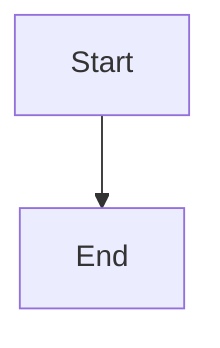

Flowcharts are composed of **nodes** (geometric shapes) and **edges** (arrows or lines). The Mermaid code defines how nodes and edges are made and accommodates different arrow types, multi-directional arrows, and any linking to and from subgraphs.

WARNING

If you are using the word "end" in a Flowchart node, capitalize the entire word or any of the letters (e.g., "End" or "END"), or apply this [workaround](https://github.com/mermaid-js/mermaid/issues/1444#issuecomment-639528897). Typing "end" in all lowercase letters will break the Flowchart.

WARNING

If you are using the letter "o" or "x" as the first letter in a connecting Flowchart node, add a space before the letter or capitalize the letter (e.g., "dev--- ops", "dev---Ops").

Typing "A---oB" will create a [circle edge](#circle-edge-example).

Typing "A---xB" will create a [cross edge](#cross-edge-example).

### A node (default) [​](#a-node-default)

INFO

The id is what is displayed in the box.

TIP

Instead of `flowchart` one can also use `graph`.

### A node with text [​](#a-node-with-text)

It is also possible to set text in the box that differs from the id. If this is done several times, it is the last text found for the node that will be used. Also if you define edges for the node later on, you can omit text definitions. The one previously defined will be used when rendering the box.

#### Unicode text [​](#unicode-text)

Use `"` to enclose the unicode text.

#### Markdown formatting [​](#markdown-formatting)

Use double quotes and backticks "` text `" to enclose the markdown text.

### Direction [​](#direction)

This statement declares the direction of the Flowchart.

This declares the flowchart is oriented from top to bottom (`TD` or `TB`).

This declares the flowchart is oriented from left to right (`LR`).

Possible FlowChart orientations are:

* TB - Top to bottom
* TD - Top-down/ same as top to bottom
* BT - Bottom to top
* RL - Right to left
* LR - Left to right