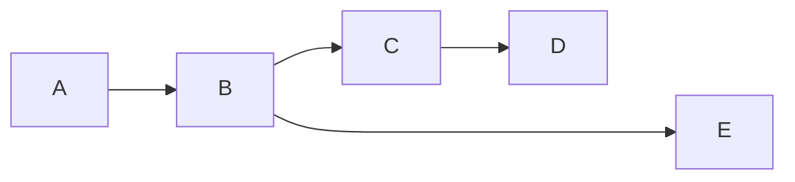
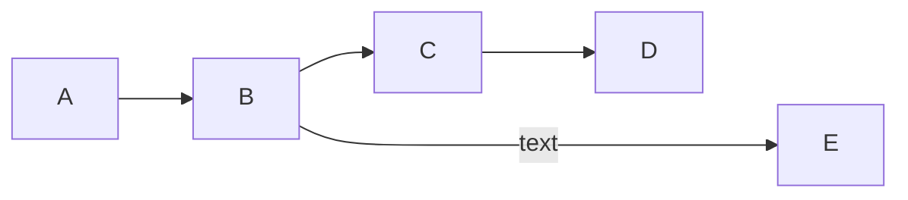

### Minimum length of a link [​](#minimum-length-of-a-link)

Each node in the flowchart is ultimately assigned to a rank in the rendered graph, i.e. to a vertical or horizontal level (depending on the flowchart orientation), based on the nodes to which it is linked. By default, links can span any number of ranks, but you can ask for any link to be longer than the others by adding extra dashes in the link definition.

In the following example, two extra dashes are added in the link from node *B* to node *E*, so that it spans two more ranks than regular links:

> **Note** Links may still be made longer than the requested number of ranks by the rendering engine to accommodate other requests.

When the link label is written in the middle of the link, the extra dashes must be added on the right side of the link. The following example is equivalent to the previous one:

For dotted or thick links, the characters to add are equals signs or dots, as summed up in the following table:

| Length | 1 | 2 | 3 |
| --- | --- | --- | --- |
| Normal | `---` | `----` | `-----` |
| Normal with arrow | `-->` | `--->` | `---->` |
| Thick | `===` | `====` | `=====` |
| Thick with arrow | `==>` | `===>` | `====>` |
| Dotted | `-.-` | `-..-` | `-...-` |
| Dotted with arrow | `-.->` | `-..->` | `-...->` |