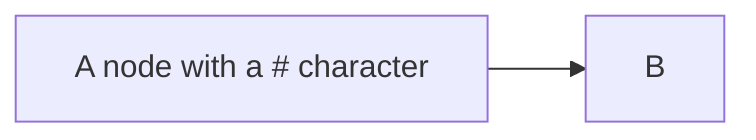

## Special characters that break syntax [​](#special-characters-that-break-syntax)

It is possible to put text within quotes in order to render more troublesome characters. As in the example below:

### Entity codes to escape characters [​](#entity-codes-to-escape-characters)

It is possible to escape characters using the syntax exemplified here.

Numbers given are base 10, so `#` can be encoded as `#35;`. It is also supported to use HTML character names.