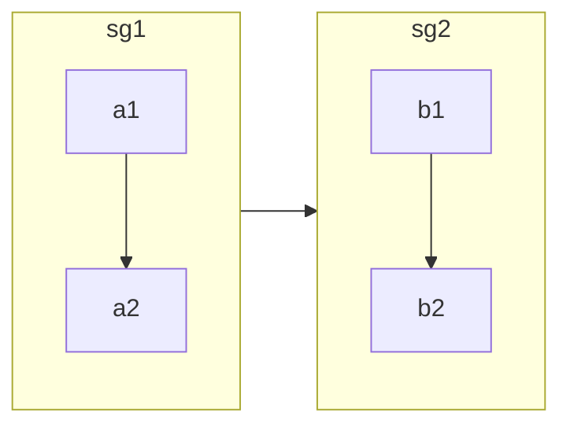
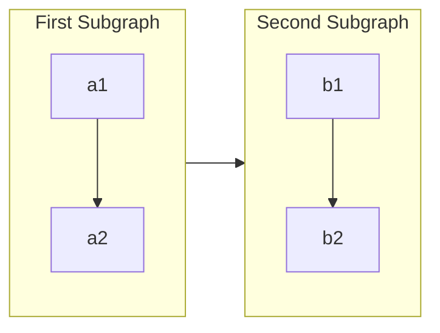
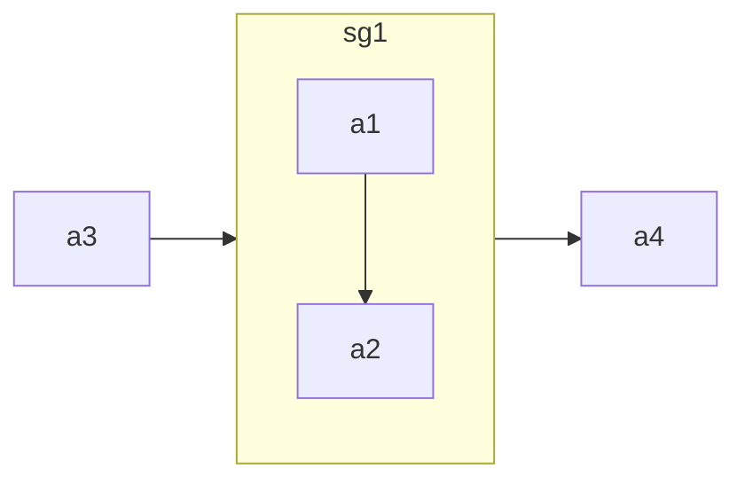
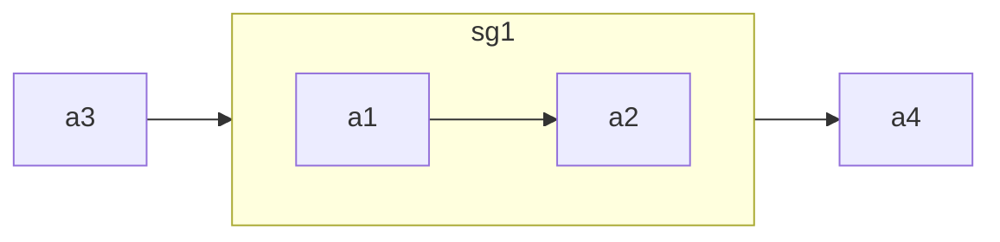

## Subgraphs [​](#subgraphs)

```
subgraph title
    graph definition
end
```

An example below:



You can also set an explicit id for the subgraph.



### flowcharts [​](#flowcharts)

With the graphtype flowchart it is also possible to set edges to and from subgraphs as in the flowchart below.



### Direction in subgraphs [​](#direction-in-subgraphs)

With the graphtype flowcharts you can use the direction statement to set the direction which the subgraph will render like in this example.



#### Limitation [​](#limitation)

If any of a subgraph's nodes are linked to the outside, subgraph direction will be ignored. Instead the subgraph will inherit the direction of the parent graph:

```mermaid
graph LR
    direction TB
    subgraph sg1
        direction LR
        a1 --> a2
    end
    a3 --> sg1
    sg1 --> a4
    a1 --> a3