## Node shapes [​](#node-shapes)

### A node with round edges [​](#a-node-with-round-edges)

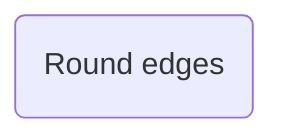

### A stadium-shaped node [​](#a-stadium-shaped-node)

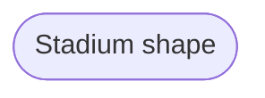

### A node in a subroutine shape [​](#a-node-in-a-subroutine-shape)

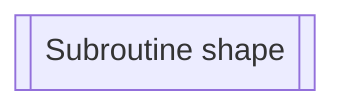

### A node in a cylindrical shape [​](#a-node-in-a-cylindrical-shape)

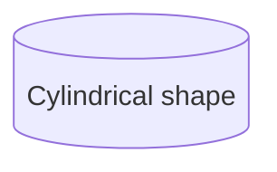

### A node in the form of a circle [​](#a-node-in-the-form-of-a-circle)

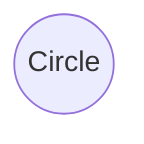

### A node in an asymmetric shape [​](#a-node-in-an-asymmetric-shape)

Currently only the shape above is possible and not its mirror. *This might change with future releases.*

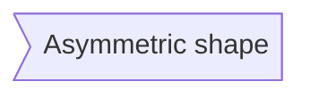

### A node (rhombus) [​](#a-node-rhombus)

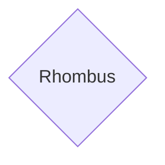

### A hexagon node [​](#a-hexagon-node)

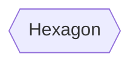

### Parallelogram [​](#parallelogram)

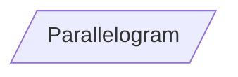

### Parallelogram alt [​](#parallelogram-alt)

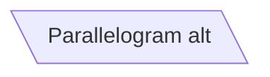

### Trapezoid [​](#trapezoid)

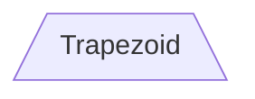

### Trapezoid alt [​](#trapezoid-alt)

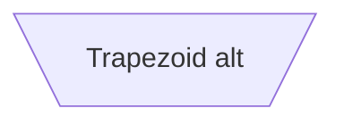

### Double circle [​](#double-circle)

```mermaid
graph LR
    A(((Double circle)))