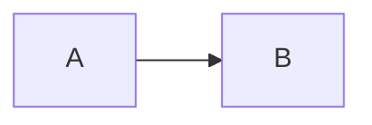
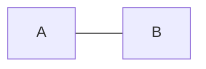
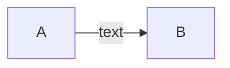
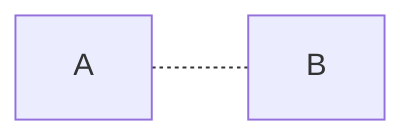
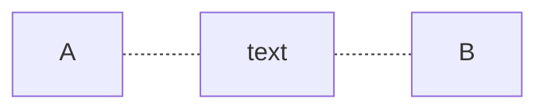
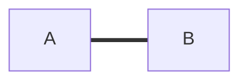
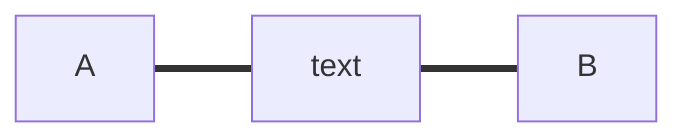
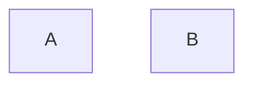
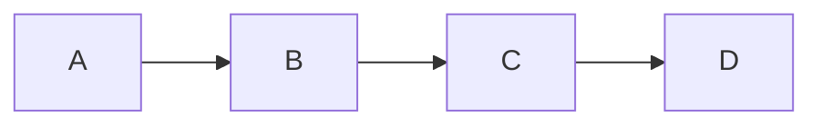
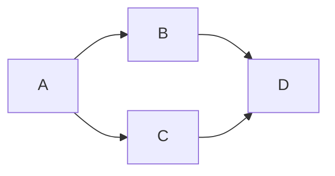

## Links between nodes [​](#links-between-nodes)

Nodes can be connected with links/edges. It is possible to have different types of links or attach a text string to a link.

### A link with arrow head [​](#a-link-with-arrow-head)



### An open link [​](#an-open-link)



### Text on links [​](#text-on-links)

```mermaid
graph LR
    A -- text -- B
```

or

```mermaid
graph LR
    A -- "text" -- B
```

### A link with arrow head and text [​](#a-link-with-arrow-head-and-text)



or


### Dotted link [​](#dotted-link)



### Dotted link with text [​](#dotted-link-with-text)



### Thick link [​](#thick-link)



### Thick link with text [​](#thick-link-with-text)



### An invisible link [​](#an-invisible-link)

This can be a useful tool in some instances where you want to alter the default positioning of a node.



### Chaining of links [​](#chaining-of-links)

It is possible declare many links in the same line as per below:



It is also possible to declare multiple nodes links in the same line as per below:

```mermaid
graph LR
    A --> B, C --> D
```

You can then describe dependencies in a very expressive way. Like the one-liner below:



If you describe the same diagram using the basic syntax, it will take four lines. A word of warning, one could go overboard with this making the flowchart harder to read in markdown form. The Swedish word `lagom` comes to mind. It means, not too much and not too little. This goes for expressive syntaxes as well.