Flowcharts are composed of **nodes** (geometric shapes) and **edges** (arrows or lines). The Mermaid code defines how nodes and edges are made and accommodates different arrow types, multi-directional arrows, and any linking to and from subgraphs.

WARNING

If you are using the word "end" in a Flowchart node, capitalize the entire word or any of the letters (e.g., "End" or "END"), or apply this [workaround](https://github.com/mermaid-js/mermaid/issues/1444#issuecomment-639528897). Typing "end" in all lowercase letters will break the Flowchart.

WARNING

If you are using the letter "o" or "x" as the first letter in a connecting Flowchart node, add a space before the letter or capitalize the letter (e.g., "dev--- ops", "dev---Ops").

Typing "A---oB" will create a [circle edge](#circle-edge-example).

Typing "A---xB" will create a [cross edge](#cross-edge-example).

### A node (default) [​](#a-node-default)

INFO

The id is what is displayed in the box.

TIP

Instead of `flowchart` one can also use `graph`.

### A node with text [​](#a-node-with-text)

It is also possible to set text in the box that differs from the id. If this is done several times, it is the last text found for the node that will be used. Also if you define edges for the node later on, you can omit text definitions. The one previously defined will be used when rendering the box.

#### Unicode text [​](#unicode-text)

Use `"` to enclose the unicode text.

#### Markdown formatting [​](#markdown-formatting)

Use double quotes and backticks "` text `" to enclose the markdown text.

### Direction [​](#direction)

This statement declares the direction of the Flowchart.

This declares the flowchart is oriented from top to bottom (`TD` or `TB`).

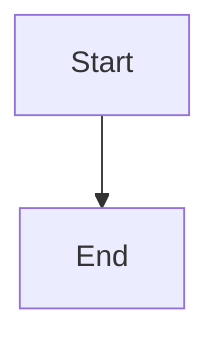

This declares the flowchart is oriented from left to right (`LR`).

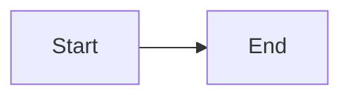

Possible FlowChart orientations are:

* TB - Top to bottom
* TD - Top-down/ same as top to bottom
* BT - Bottom to top
* RL - Right to left
* LR - Left to right

## Node shapes [​](#node-shapes)

### A node with round edges [​](#a-node-with-round-edges)

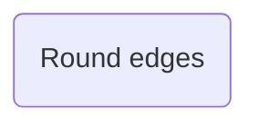

### A stadium-shaped node [​](#a-stadium-shaped-node)

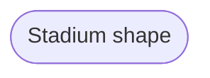

### A node in a subroutine shape [​](#a-node-in-a-subroutine-shape)

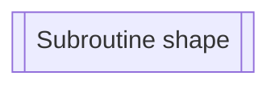

### A node in a cylindrical shape [​](#a-node-in-a-cylindrical-shape)

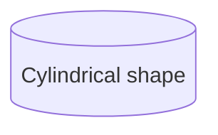

### A node in the form of a circle [​](#a-node-in-the-form-of-a-circle)

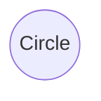

### A node in an asymmetric shape [​](#a-node-in-an-asymmetric-shape)

Currently only the shape above is possible and not its mirror. *This might change with future releases.*

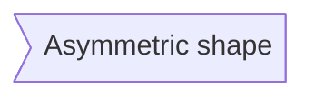

### A node (rhombus) [​](#a-node-rhombus)

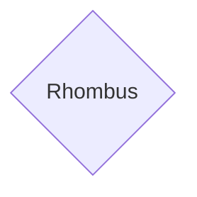

### A hexagon node [​](#a-hexagon-node)

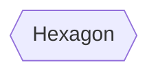

### Parallelogram [​](#parallelogram)

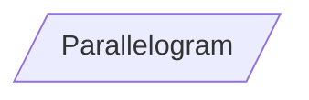

### Parallelogram alt [​](#parallelogram-alt)

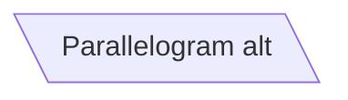

### Trapezoid [​](#trapezoid)

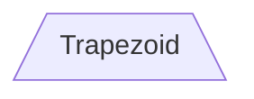

### Trapezoid alt [​](#trapezoid-alt)

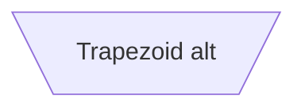

### Double circle [​](#double-circle)

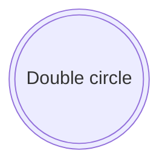

## Expanded Node Shapes in Mermaid Flowcharts (v11.3.0+) [​](#expanded-node-shapes-in-mermaid-flowcharts-v11-3-0)

Mermaid introduces 30 new shapes to enhance the flexibility and precision of flowchart creation. These new shapes provide more options to represent processes, decisions, events, data storage visually, and other elements within your flowcharts, improving clarity and semantic meaning.

New Syntax for Shape Definition

Mermaid now supports a general syntax for defining shape types to accommodate the growing number of shapes. This syntax allows you to assign specific shapes to nodes using a clear and flexible format:

```mermaid
graph LR
    A["A" shape="rect"]
```

This syntax creates a node A as a rectangle. It renders in the same way as `A["A"]`, or `A`.

### Complete List of New Shapes [​](#complete-list-of-new-shapes)

Below is a comprehensive list of the newly introduced shapes and their corresponding semantic meanings, short names, and aliases:

| **Semantic Name** | **Shape Name** | **Short Name** | **Description** | **Alias Supported** |
| --- | --- | --- | --- | --- |
| Card | Notched Rectangle | `notch-rect` | Represents a card | `card`, `notched-rectangle` |
| Collate | Hourglass | `hourglass` | Represents a collate operation | `collate`, `hourglass` |
| Com Link | Lightning Bolt | `bolt` | Communication link | `com-link`, `lightning-bolt` |
| Comment | Curly Brace | `brace` | Adds a comment | `brace-l`, `comment` |
| Comment Right | Curly Brace | `brace-r` | Adds a comment |  |
| Comment with braces on both sides | Curly Braces | `braces` | Adds a comment |  |
| Data Input/Output | Lean Right | `lean-r` | Represents input or output | `in-out`, `lean-right` |
| Data Input/Output | Lean Left | `lean-l` | Represents output or input | `lean-left`, `out-in` |
| Database | Cylinder | `cyl` | Database storage | `cylinder`, `database`, `db` |
| Decision | Diamond | `diam` | Decision-making step | `decision`, `diamond`, `question` |
| Delay | Half-Rounded Rectangle | `delay` | Represents a delay | `half-rounded-rectangle` |
| Direct Access Storage | Horizontal Cylinder | `h-cyl` | Direct access storage | `das`, `horizontal-cylinder` |
| Disk Storage | Lined Cylinder | `lin-cyl` | Disk storage | `disk`, `lined-cylinder` |
| Display | Curved Trapezoid | `curv-trap` | Represents a display | `curved-trapezoid`, `display` |
| Divided Process | Divided Rectangle | `div-rect` | Divided process shape | `div-proc`, `divided-process`, `divided-rectangle` |
| Document | Document | `doc` | Represents a document | `doc`, `document` |
| Event | Rounded Rectangle | `rounded` | Represents an event | `event` |
| Extract | Triangle | `tri` | Extraction process | `extract`, `triangle` |
| Fork/Join | Filled Rectangle | `fork` | Fork or join in process flow | `join` |
| Internal Storage | Window Pane | `win-pane` | Internal storage | `internal-storage`, `window-pane` |
| Junction | Filled Circle | `f-circ` | Junction point | `filled-circle`, `junction` |
| Lined Document | Lined Document | `lin-doc` | Lined document | `lined-document` |
| Lined/Shaded Process | Lined Rectangle | `lin-rect` | Lined process shape | `lin-proc`, `lined-process`, `lined-rectangle`, `shaded-process` |
| Loop Limit | Trapezoidal Pentagon | `notch-pent` | Loop limit step | `loop-limit`, `notched-pentagon` |
| Manual File | Flipped Triangle | `flip-tri` | Manual file operation | `flipped-triangle`, `manual-file` |
| Manual Input | Sloped Rectangle | `sl-rect` | Manual input step | `manual-input`, `sloped-rectangle` |
| Manual Operation | Trapezoid Base Top | `trap-t` | Represents a manual task | `inv-trapezoid`, `manual`, `trapezoid-top` |
| Multi-Document | Stacked Document | `docs` | Multiple documents | `documents`, `st-doc`, `stacked-document` |
| Multi-Process | Stacked Rectangle | `st-rect` | Multiple processes | `processes`, `procs`, `stacked-rectangle` |
| Odd | Odd | `odd` | Odd shape |  |
| Paper Tape | Flag | `flag` | Paper tape | `paper-tape` |
| Prepare Conditional | Hexagon | `hex` | Preparation or condition step | `hexagon`, `prepare` |
| Priority Action | Trapezoid Base Bottom | `trap-b` | Priority action | `priority`, `trapezoid`, `trapezoid-bottom` |
| Process | Rectangle | `rect` | Standard process shape | `proc`, `process`, `rectangle` |
| Start | Circle | `circle` | Starting point | `circ` |
| Start | Small Circle | `sm-circ` | Small starting point | `small-circle`, `start` |
| Stop | Double Circle | `dbl-circ` | Represents a stop point | `double-circle` |
| Stop | Framed Circle | `fr-circ` | Stop point | `framed-circle`, `stop` |
| Stored Data | Bow Tie Rectangle | `bow-rect` | Stored data | `bow-tie-rectangle`, `stored-data` |
| Subprocess | Framed Rectangle | `fr-rect` | Subprocess | `framed-rectangle`, `subproc`, `subprocess`, `subroutine` |
| Summary | Crossed Circle | `cross-circ` | Summary | `crossed-circle`, `summary` |
| Tagged Document | Tagged Document | `tag-doc` | Tagged document | `tag-doc`, `tagged-document` |
| Tagged Process | Tagged Rectangle | `tag-rect` | Tagged process | `tag-proc`, `tagged-process`, `tagged-rectangle` |
| Terminal Point | Stadium | `stadium` | Terminal point | `pill`, `terminal` |
| Text Block | Text Block | `text` | Text block |  |

### Example Flowchart with New Shapes [​](#example-flowchart-with-new-shapes)

Here’s an example flowchart that utilizes some of the newly introduced shapes:

```mermaid
graph LR
    A[Process]
    B(Event)
    C([Terminal Point])
    D[[Subprocess]]
    E[(Database)]
    F((Start))
    G>Odd]
    H{Decision}
    I{{Prepare Conditional}}
    J[/Data Input/Output/]
    K[\Data Input/Output\]
    L[/Priority Action\]
    M[\Manual Operation/]
    N(((Stop)))
    O[text]
    P["Card" shape="notch-rect"]
    Q["Lined/Shaded Process" shape="lin-rect"]
    R((Start))
    S((Stop))
    T[Fork/Join shape="fork"]
    U(Collate shape="hourglass")
    V{Comment shape="brace"}
    W{Comment Right shape="brace-r"}
    X{Comment with braces on both sides shape="braces"}
    Y[Com Link shape="bolt"]
    Z[Document shape="doc"]
    AA(Delay shape="delay")
    AB[(Direct Access Storage) shape="h-cyl"]
    AC[(Disk Storage) shape="lin-cyl"]
    AD[/Display/ shape="curv-trap"]
    AE[/Divided Process/ shape="div-rect"]
    AF[Extract shape="tri"]
    AG[(Internal Storage) shape="win-pane"]
    AH((Junction) shape="f-circ")
    AI[Lined Document shape="lin-doc"]
    AJ[/Loop Limit/ shape="notch-pent"]
    AK[\Manual File/ shape="flip-tri"]
    AL[/Manual Input/ shape="sl-rect"]
    AM[\Multi-Document/ shape="docs"]
    AN[/Multi-Process/ shape="st-rect"]
    AO[Paper Tape shape="flag"]
    AP[(Stored Data) shape="bow-rect"]
    AQ(((Summary)))
    AR[Tagged Document shape="tag-doc"]
    AS[/Tagged Process/ shape="tag-rect"]
    A-->B-->C-->D-->E-->F-->G-->H-->I-->J-->K-->L-->M-->N-->O-->P-->Q-->R-->S-->T-->U-->V-->W-->X-->Y-->Z-->AA-->AB-->AC-->AD-->AE-->AF-->AG-->AH-->AI-->AJ-->AK-->AL-->AM-->AN-->AO-->AP-->AQ-->AR-->AS
```

### Process [​](#process)

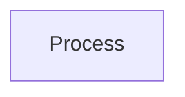

### Event [​](#event)

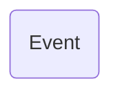

### Terminal Point (Stadium) [​](#terminal-point-stadium)

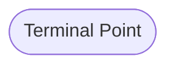

### Subprocess [​](#subprocess)

```mermaid
graph LR
    A[[Subprocess]]
```

### Database (Cylinder) [​](#database-cylinder)

```mermaid
graph LR
    A[(Database)]
```

### Start (Circle) [​](#start-circle)

```mermaid
graph LR
    A((Start))
```

### Odd [​](#odd)

```mermaid
graph LR
    A>Odd]
```

### Decision (Diamond) [​](#decision-diamond)

```mermaid
graph LR
    A{Decision}
```

### Prepare Conditional (Hexagon) [​](#prepare-conditional-hexagon)

```mermaid
graph LR
    A{{Prepare Conditional}}
```

### Data Input/Output (Lean Right) [​](#data-input-output-lean-right)

```mermaid
graph LR
    A[/Data Input/Output/]
```

### Data Input/Output (Lean Left) [​](#data-input-output-lean-left)

```mermaid
graph LR
    A[\Data Input/Output\]
```

### Priority Action (Trapezoid Base Bottom) [​](#priority-action-trapezoid-base-bottom)

```mermaid
graph LR
    A[/Priority Action\]
```

### Manual Operation (Trapezoid Base Top) [​](#manual-operation-trapezoid-base-top)

```mermaid
graph LR
    A[\Manual Operation/]
```

### Stop (Double Circle) [​](#stop-double-circle)

```mermaid
graph LR
    A(((Stop)))
```

### Text Block [​](#text-block)

```mermaid
graph LR
    A[text]
```

### Card (Notched Rectangle) [​](#card-notched-rectangle)

```mermaid
graph LR
    A["Card" shape="notch-rect"]
```

### Lined/Shaded Process [​](#lined-shaded-process)

```mermaid
graph LR
    A["Lined/Shaded Process" shape="lin-rect"]
```

### Start (Small Circle) [​](#start-small-circle)

```mermaid
graph LR
    A((Start))
```

### Stop (Framed Circle) [​](#stop-framed-circle)

```mermaid
graph LR
    A((Stop))
```

### Fork/Join (Long Rectangle) [​](#fork-join-long-rectangle)

```mermaid
graph LR
    A[Fork/Join shape="fork"]
```

### Collate (Hourglass) [​](#collate-hourglass)

```mermaid
graph LR
    A(Collate shape="hourglass")
```

### Comment (Curly Brace) [​](#comment-curly-brace)

```mermaid
graph LR
    A{Comment shape="brace"}
```

### Comment Right (Curly Brace Right) [​](#comment-right-curly-brace-right)

```mermaid
graph LR
    A{Comment Right shape="brace-r"}
```

### Comment with braces on both sides [​](#comment-with-braces-on-both-sides)

```mermaid
graph LR
    A{Comment with braces on both sides shape="braces"}
```

### Com Link (Lightning Bolt) [​](#com-link-lightning-bolt)

```mermaid
graph LR
    A[Com Link shape="bolt"]
```

### Document [​](#document)

```mermaid
graph LR
    A[Document shape="doc"]
```

### Delay (Half-Rounded Rectangle) [​](#delay-half-rounded-rectangle)

```mermaid
graph LR
    A(Delay shape="delay")
```

### Direct Access Storage (Horizontal Cylinder) [​](#direct-access-storage-horizontal-cylinder)

```mermaid
graph LR
    A[(Direct Access Storage) shape="h-cyl"]
```

### Disk Storage (Lined Cylinder) [​](#disk-storage-lined-cylinder)

```mermaid
graph LR
    A[(Disk Storage) shape="lin-cyl"]
```

### Display (Curved Trapezoid) [​](#display-curved-trapezoid)

```mermaid
graph LR
    A[/Display/ shape="curv-trap"]
```

### Divided Process (Divided Rectangle) [​](#divided-process-divided-rectangle)

```mermaid
graph LR
    A[/Divided Process/ shape="div-rect"]
```

### Extract (Small Triangle) [​](#extract-small-triangle)

```mermaid
graph LR
    A[Extract shape="tri"]
```

### Internal Storage (Window Pane) [​](#internal-storage-window-pane)

```mermaid
graph LR
    A[(Internal Storage) shape="win-pane"]
```

### Junction (Filled Circle) [​](#junction-filled-circle)

```mermaid
graph LR
    A((Junction) shape="f-circ")
```

### Lined Document [​](#lined-document)

```mermaid
graph LR
    A[Lined Document shape="lin-doc"]
```

### Loop Limit (Notched Pentagon) [​](#loop-limit-notched-pentagon)

```mermaid
graph LR
    A[/Loop Limit/ shape="notch-pent"]
```

### Manual File (Flipped Triangle) [​](#manual-file-flipped-triangle)

```mermaid
graph LR
    A[\Manual File/ shape="flip-tri"]
```

### Manual Input (Sloped Rectangle) [​](#manual-input-sloped-rectangle)

```mermaid
graph LR
    A[/Manual Input/ shape="sl-rect"]
```

### Multi-Document (Stacked Document) [​](#multi-document-stacked-document)

```mermaid
graph LR
    A[\Multi-Document/ shape="docs"]
```

### Multi-Process (Stacked Rectangle) [​](#multi-process-stacked-rectangle)

```mermaid
graph LR
    A[/Multi-Process/ shape="st-rect"]
```

### Paper Tape (Flag) [​](#paper-tape-flag)

```mermaid
graph LR
    A[Paper Tape shape="flag"]
```

### Stored Data (Bow Tie Rectangle) [​](#stored-data-bow-tie-rectangle)

```mermaid
graph LR
    A[(Stored Data) shape="bow-rect"]
```

### Summary (Crossed Circle) [​](#summary-crossed-circle)

```mermaid
graph LR
    A(((Summary)))
```

### Tagged Document [​](#tagged-document)

```mermaid
graph LR
    A[Tagged Document shape="tag-doc"]
```

### Tagged Process (Tagged Rectangle) [​](#tagged-process-tagged-rectangle)

```mermaid
graph LR
    A[/Tagged Process/ shape="tag-rect"]
```

## Links between nodes [​](#links-between-nodes)

Nodes can be connected with links/edges. It is possible to have different types of links or attach a text string to a link.

### A link with arrow head [​](#a-link-with-arrow-head)

```mermaid
graph LR
    A --> B
```

### An open link [​](#an-open-link)

```mermaid
graph LR
    A --- B
```

### Text on links [​](#text-on-links)

```mermaid
graph LR
    A -- text -- B
```

or

```mermaid
graph LR
    A -- "text" -- B
```

### A link with arrow head and text [​](#a-link-with-arrow-head-and-text)

```mermaid
graph LR
    A -->|text| B
```

or

```mermaid
graph LR
    A -- text --> B
```

### Dotted link [​](#dotted-link)

```mermaid
graph LR
    A -.- B
```

### Dotted link with text [​](#dotted-link-with-text)

```mermaid
graph LR
    A -.- text -.- B
```

### Thick link [​](#thick-link)

```mermaid
graph LR
    A === B
```

### Thick link with text [​](#thick-link-with-text)

```mermaid
graph LR
    A === text === B
```

### An invisible link [​](#an-invisible-link)

This can be a useful tool in some instances where you want to alter the default positioning of a node.

```mermaid
graph LR
    A ~~~ B
```

### Chaining of links [​](#chaining-of-links)

It is possible declare many links in the same line as per below:

```mermaid
graph LR
    A --> B --> C --> D
```

It is also possible to declare multiple nodes links in the same line as per below:

```mermaid
graph LR
    A --> B, C --> D
```

You can then describe dependencies in a very expressive way. Like the one-liner below:

```mermaid
graph LR
    A --> B & C --> D
```

If you describe the same diagram using the basic syntax, it will take four lines. A word of warning, one could go overboard with this making the flowchart harder to read in markdown form. The Swedish word `lagom` comes to mind. It means, not too much and not too little. This goes for expressive syntaxes as well.

## New arrow types [​](#new-arrow-types)

There are new types of arrows supported:

* circle edge
* cross edge

### Circle edge example [​](#circle-edge-example)

```mermaid
graph LR
    A---oB
```

### Cross edge example [​](#cross-edge-example)

```mermaid
graph LR
    A---xB
```

## Multi directional arrows [​](#multi-directional-arrows)

There is the possibility to use multidirectional arrows.

```mermaid
graph LR
    A <--> B
```

### Minimum length of a link [​](#minimum-length-of-a-link)

Each node in the flowchart is ultimately assigned to a rank in the rendered graph, i.e. to a vertical or horizontal level (depending on the flowchart orientation), based on the nodes to which it is linked. By default, links can span any number of ranks, but you can ask for any link to be longer than the others by adding extra dashes in the link definition.

In the following example, two extra dashes are added in the link from node *B* to node *E*, so that it spans two more ranks than regular links:

```mermaid
graph LR
    A --> B --> C --> D
    B ----> E
```

> **Note** Links may still be made longer than the requested number of ranks by the rendering engine to accommodate other requests.

When the link label is written in the middle of the link, the extra dashes must be added on the right side of the link. The following example is equivalent to the previous one:

```mermaid
graph LR
    A --> B --> C --> D
    B -- text ----> E
```

For dotted or thick links, the characters to add are equals signs or dots, as summed up in the following table:

| Length | 1 | 2 | 3 |
| --- | --- | --- | --- |
| Normal | `---` | `----` | `-----` |
| Normal with arrow | `-->` | `--->` | `---->` |
| Thick | `===` | `====` | `=====` |
| Thick with arrow | `==>` | `===>` | `====>` |
| Dotted | `-.-` | `-..-` | `-...-` |
| Dotted with arrow | `-.->` | `-..->` | `-...->` |

## Special characters that break syntax [​](#special-characters-that-break-syntax)

It is possible to put text within quotes in order to render more troublesome characters. As in the example below:

### Entity codes to escape characters [​](#entity-codes-to-escape-characters)

It is possible to escape characters using the syntax exemplified here.

Numbers given are base 10, so `#` can be encoded as `#35;`. It is also supported to use HTML character names.

## Subgraphs [​](#subgraphs)

```
subgraph title
    graph definition
end
```

An example below:

You can also set an explicit id for the subgraph.

### flowcharts [​](#flowcharts)

With the graphtype flowchart it is also possible to set edges to and from subgraphs as in the flowchart below.

### Direction in subgraphs [​](#direction-in-subgraphs)

With the graphtype flowcharts you can use the direction statement to set the direction which the subgraph will render like in this example.

#### Limitation [​](#limitation)

If any of a subgraph's nodes are linked to the outside, subgraph direction will be ignored. Instead the subgraph will inherit the direction of the parent graph:

## Markdown Strings [​](#markdown-strings)

The "Markdown Strings" feature enhances flowcharts and mind maps by offering a more versatile string type, which supports text formatting options such as bold and italics, and automatically wraps text within labels.

Formatting:

* For bold text, use double asterisks (`**`) before and after the text.
* For italics, use single asterisks (`*`) before and after the text.
* With traditional strings, you needed to add `<br>` tags for text to wrap in nodes. However, markdown strings automatically wrap text when it becomes too long and allows you to start a new line by simply using a newline character instead of a `<br>` tag.

This feature is applicable to node labels, edge labels, and subgraph labels.

The auto wrapping can be disabled by using

```
---
config:
  markdownAutoWrap: false
---
graph LR
```
## Interaction [​](#interaction)

It is possible to bind a click event to a node, the click can lead to either a javascript callback or to a link which will be opened in a new browser tab.

INFO

This functionality is disabled when using `securityLevel='strict'` and enabled when using `securityLevel='loose'`.

```
click nodeId callback
click nodeId call callback()
```

* nodeId is the id of the node
* callback is the name of a javascript function defined on the page displaying the graph, the function will be called with the nodeId as parameter.

Examples of tooltip usage below:

html

```
<script>
  window.callback = function () {
    alert('A callback was triggered');
  };
</script>
```

The tooltip text is surrounded in double quotes. The styles of the tooltip are set by the class `.mermaidTooltip`.

> **Success** The tooltip functionality and the ability to link to urls are available from version 0.5.2.

?> Due to limitations with how Docsify handles JavaScript callback functions, an alternate working demo for the above code can be viewed at [this jsfiddle](https://jsfiddle.net/yk4h7qou/2/).

Links are opened in the same browser tab/window by default. It is possible to change this by adding a link target to the click definition (`_self`, `_blank`, `_parent` and `_top` are supported):

Beginner's tip—a full example using interactive links in a html context:

html

```
<body>
  <pre class="mermaid">
    flowchart LR
        A-->B
        B-->C
        C-->D
        click A callback "Tooltip"
        click B "https://www.github.com" "This is a link"
        click C call callback() "Tooltip"
        click D href "https://www.github.com" "This is a link"
  </pre>

  <script>
    window.callback = function () {
      alert('A callback was triggered');
    };
    const config = {
      startOnLoad: true,
      flowchart: { useMaxWidth: true, htmlLabels: true, curve: 'cardinal' },
      securityLevel: 'loose',
    };
    mermaid.initialize(config);
  </script>
</body>
```
### Comments [​](#comments)

Comments can be entered within a flow diagram, which will be ignored by the parser. Comments need to be on their own line, and must be prefaced with `%%` (double percent signs). Any text after the start of the comment to the next newline will be treated as a comment, including any flow syntax

## Styling and classes [​](#styling-and-classes)

### Styling links [​](#styling-links)

It is possible to style links. For instance, you might want to style a link that is going backwards in the flow. As links have no ids in the same way as nodes, some other way of deciding what style the links should be attached to is required. Instead of ids, the order number of when the link was defined in the graph is used, or use default to apply to all links. In the example below the style defined in the linkStyle statement will belong to the fourth link in the graph:

```
linkStyle 3 stroke:#ff3,stroke-width:4px,color:red;
```

It is also possible to add style to multiple links in a single statement, by separating link numbers with commas:

```
linkStyle 1,2,7 color:blue;
```
### Styling line curves [​](#styling-line-curves)

It is possible to style the type of curve used for lines between items, if the default method does not meet your needs. Available curve styles include `basis`, `bumpX`, `bumpY`, `cardinal`, `catmullRom`, `linear`, `monotoneX`, `monotoneY`, `natural`, `step`, `stepAfter`, and `stepBefore`.

In this example, a left-to-right graph uses the `stepBefore` curve style:

```
%%{ init: { 'flowchart': { 'curve': 'stepBefore' } } }%%
graph LR
    A --> B
    B --> C
```

For a full list of available curves, including an explanation of custom curves, refer to the [Shapes](https://github.com/d3/d3-shape/blob/main/README.md#curves) documentation in the [d3-shape](https://github.com/d3/d3-shape/) project.

### Styling a node [​](#styling-a-node)

It is possible to apply specific styles such as a thicker border or a different background color to a node.

#### Classes [​](#classes)

More convenient than defining the style every time is to define a class of styles and attach this class to the nodes that should have a different look.

A class definition looks like the example below:

```
    classDef className fill:#f9f,stroke:#333,stroke-width:4px;
    A[A node]:::className
```

Also, it is possible to define style to multiple classes in one statement:

```
    classDef firstClassName,secondClassName font-size:12pt;
    A[A node]:::firstClassName
    B[B node]:::secondClassName
```

Attachment of a class to a node is done as per below:

It is also possible to attach a class to a list of nodes in one statement:

```
    classDef className fill:#f9f,stroke:#333,stroke-width:4px;
    A[A node],B[B node]:::className
```

A shorter form of adding a class is to attach the classname to the node using the `:::`operator as per below:

```
    classDef className fill:#f9f,stroke:#333,stroke-width:4px;
    A[A node]:::className
```

This form can be used when declaring multiple links between nodes:

```mermaid
graph LR
    classDef className fill
