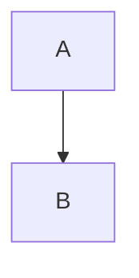

## mermaid-cli

[](https://www.npmjs.com/package/@mermaid-js/mermaid-cli)
[](https://www.npmjs.com/package/@mermaid-js/mermaid-cli)
[](https://hub.docker.com/r/minlag/mermaid-cli)
[](https://github.com/mermaid-js/mermaid-cli/actions/workflows/compile-mermaid.yml)
[](https://percy.io/Mermaid/mermaid-cli)
[](https://join.slack.com/t/mermaid-talk/shared_invite/enQtNzc4NDIyNzk4OTAyLWVhYjQxOTI2OTg4YmE1ZmJkY2Y4MTU3ODliYmIwOTY3NDJlYjA0YjIyZTdkMDMyZTUwOGI0NjEzYmEwODcwOTE)

This is a command-line interface (CLI) for [mermaid](https://mermaid.js.org/). It takes a mermaid definition file as input and generates an svg/png/pdf file as output.


## Installation


```
npm install -g @mermaid-js/mermaid-cli
```


## Usage


Convert Mermaid mmd Diagram File To SVG

```
mmdc -i input.mmd -o output.svg
```
> **Note**
> 
> See [Alternative installations](#alternative-installations) if you don't want to install the package globally.
> 
> Locate how to call the mmdc executable for your preferred method
> i.e. Docker, Yarn, NPM, local install, etc.


## Examples


### Create A PNG With A Dark Theme And Transparent Background


```
mmdc -i input.mmd -o output.png -t dark -b transparent
```


### Animating an SVG file with custom CSS


The `--cssFile` option can be used to inline some custom CSS.

Please see [./test-positive/flowchart1.css](/mermaid-js/mermaid-cli/blob/master/test-positive/flowchart1.css) for an example of a CSS file that has animations.

**Warning**: If you want to override `mermaid`'s [`themeCSS`](https://mermaid.js.org/config/schema-docs/config.html#themecss), we recommend instead adding `{"themeCSS": "..."})` to your mermaid `--configFile`. You may also need to use [`!important`](https://developer.mozilla.org/en-US/docs/Web/CSS/important) to override mermiad's `themeCSS`.

**Warning**: Inline CSS files may be blocked by your browser, depending on the [HTTP Content-Security-Policy header](https://developer.mozilla.org/en-US/docs/Web/HTTP/Headers/Content-Security-Policy) of the website that hosts your SVG.

```
mmdc --input test-positive/flowchart1.mmd --cssFile test-positive/flowchart1.css -o docs/animated-flowchart.svg
```

Example output: docs/animated-flowchart.svg

[](/mermaid-js/mermaid-cli/blob/master/docs/animated-flowchart.svg)


### Transform a markdown file with mermaid diagrams


```
mmdc -i readme.template.md -o readme.md
```

This command transforms a markdown file itself. The mermaid-cli will find the mermaid diagrams, create SVG files from them and refer to those in the markdown output.

This:

```
### Some markdown
```mermaid
graph
   [....]
```

### Some more markdown
```mermaid
sequenceDiagram
   [....]
```

### Mermaid with custom title/desc

```

Becomes:

```
### Some markdown


### Some more markdown


### Mermaid with custom title/desc

```


### Piping from stdin


You can easily pipe input from stdin. This example shows how to use a heredoc to
send a diagram as stdin to mermaid-cli (mmdc).

```
cat << EOF  | mmdc --input -
    graph TD
    A[Client] --> B[Load Balancer]
EOF
```


### See All Available Options


## Alternative installations


## Use Docker/Podman:


```
docker pull minlag/mermaid-cli
```

or pull from Github Container Registry

```
docker pull ghcr.io/mermaid-js/mermaid-cli/mermaid-cli
```

or e.g. version 8.8.0

```
docker pull minlag/mermaid-cli:8.8.0
```

The container looks for input files in `/data`. So for example, if you have a
diagram defined on your system in `/path/to/diagrams/diagram.mmd`, you can use
the container to generate an SVG file as follows:

```
docker run --rm -u `id -u`:`id -g` -v /path/to/diagrams:/data minlag/mermaid-cli -i diagram.mmd
```

Or, if using [Podman](https://podman.io/), instead do:

```
podman run --userns keep-id --user ${UID} --rm -v /path/to/diagrams:/data:z ghcr.io/mermaid-js/mermaid-cli/mermaid-cli -i diagram.mmd
```

The key differences in the podman command versus the docker command are:

* The addition of the `--userns keep-id` argument. This allows the container to keep the same UID as the current user's UID in the container namespace instead of mapping to a subuid. Docs can be found [here](https://docs.podman.io/en/latest/markdown/options/userns.container.html)
* The addition of `:z` to the end of the volume mapping. This instructs podman to relabel the files in the volume with the SELinux label `container_file_t`, which allows processes in the container to access the files. See the "Labeling Volume Mounts" section [here](https://docs.podman.io/en/latest/markdown/podman-run.1.html#volume-v-source-volume-host-dir-container-dir-options) for more info.

In previous version, the input files were mounted in `/home/mermaidcli`. You can
restore this behaviour with the `--workdir` option:

```
docker run [...] --workdir=/home/mermaidcli minlag/mermaid-cli [...]
```


## Use Node.JS API


It's possible to call `mermaid-cli` via a Node.JS API.
Please be aware that **the NodeJS API is not covered by semver**, as `mermaid-cli` follows
`mermaid`'s versioning.

```
import { run } from "@mermaid-js/mermaid-cli"

await run(
   "input.mmd", "output.svg", // {optional options},
)
```


## Install locally


Some people are [having issues](https://github.com/mermaidjs/mermaid.cli/issues/15)
installing this tool globally. Installing it locally is an alternative solution:

```
npm install @mermaid-js/mermaid-cli
./node_modules/.bin/mmdc -h

```

Or use NPM:

```
npm install @mermaid-js/mermaid-cli
./node_modules/.bin/mmdc -h

```


### Run with npx


[`npx`](https://www.npmjs.com/package/npx) is installed by default with NPM. It
downloads and runs commands at the same time. To use Mermaid CLI with npx, you
need to use the `-p` flag because the package name is different than the command
it installs (`mmdc`). `npx -p @mermaid-js/mermaid-cli mmdc -h`


## Install with [brew](https://brew.sh/)


> **Warning**
> 
> This method of installation is no longer supported.
> For more details, see the [discussion](https://github.com/mermaid-js/mermaid-cli/issues/288).
> An old version of mermaid-cli can be installed with brew.


## Known issues


1. [Linux sandbox issue](/mermaid-js/mermaid-cli/blob/master/docs/linux-sandbox-issue.md)
2. [Docker permission denied issue](/mermaid-js/mermaid-cli/blob/master/docs/docker-permission-denied.md)
3. [How to setup up mermaid to use already installed chromium?](/mermaid-js/mermaid-cli/blob/master/docs/already-installed-chromium.md)


## For contributors


Contributions are welcome. See the [contribution guide](/mermaid-js/mermaid-cli/blob/master/CONTRIBUTING.md).