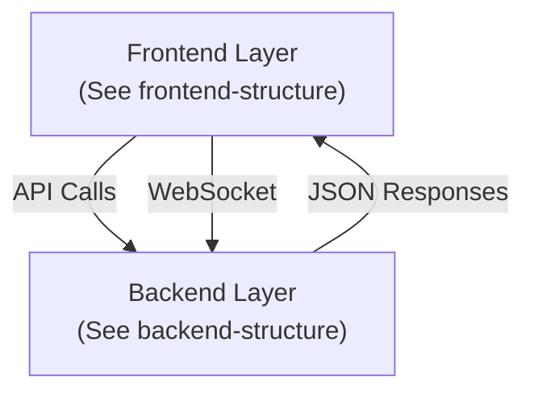
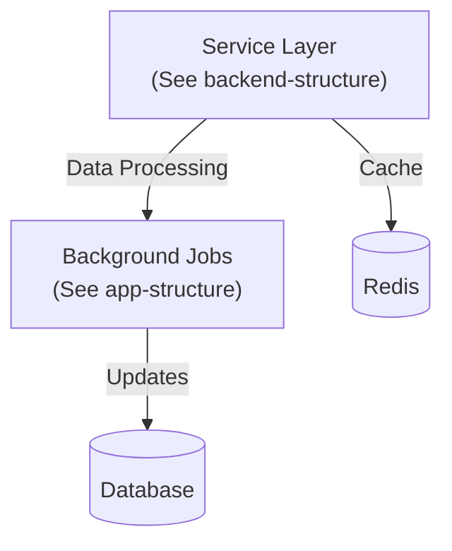

# Pipeline System Architecture Documentation

## Overview
This document serves as a central reference for the Pipeline system architecture diagrams. Each diagram is interconnected and provides a different perspective of the system architecture.

## Architecture Diagrams

### 1. High-Level System Architecture
```mermaid
reference: high-level-architecture
```

The high-level architecture diagram shows:
- Core framework integrations
- Main system layers
- Primary data flows
- Critical system components

### 2. Frontend Structure
```mermaid
reference: frontend-structure
```

The frontend structure details:
- React component hierarchy
- Page routing and organization
- UI component library integration
- State management flow

### 3. Backend Structure
```mermaid
reference: backend-structure
```

The backend structure outlines:
- Controller organization
- Service layer implementation
- Background job processing
- Model relationships

### 4. Application Directory Structure
```mermaid
reference: app-structure
```

Complete application structure including:
- All application files
- Directory hierarchy
- Component relationships
- File dependencies

### 5. View Template Structure
```mermaid
reference: view-structure
```

View template organization showing:
- ERB templates
- Partial relationships
- Layout hierarchy
- Component integration

### 6. Configuration Structure
```mermaid
reference: config-structure
```

Configuration organization detailing:
- Environment settings
- Initializers
- YAML configurations
- Security settings

### 7. Error Handling
Error handling is implemented using a combination of try-catch blocks, rescue_from blocks, and custom error classes. Pipeline::Error and its subclasses are used to handle application-specific errors, while StandardError is used for unexpected errors. Errors are logged using Rails.logger, and user feedback is provided via Turbo Streams or JSON responses.
## Integration Points

### Frontend to Backend Integration


### Service Layer Integration


## Implementation Status

### Completed Components ✅
Component | Status | Reference Diagram
----------|---------|------------------
Basic React Setup | Complete | frontend-structure
Core API Controllers | Complete | backend-structure
Database Schema | Complete | app-structure
Service Foundation | Complete | backend-structure
TypeScript Types | Complete | frontend-structure
Test Coverage | Complete | backend-structure
API Documentation | Complete | backend-structure
Error Handling | Complete | app-structure

### Missing Components ❌
Component | Status | Reference Diagram
----------|---------|------------------
Authentication | Basic | app-structure


Authorization | Basic | app-structure
WebSocket Integration | Basic | app-structure
Logging | Basic | app-structure
Monitoring | Basic | app-structure
Security | Basic | app-structure
Role management | Basic | app-structure
User management | Basic | app-structure

## System Requirements

### Frontend
- Node.js >= 16.0.0
- React 18
- TypeScript 4.9+
- ShadcnUI Components

### Backend
- Ruby 3.2+
- Rails 7.0+
- PostgreSQL 14+
- Redis 6+

## Directory References

### Frontend Structure
```
javascript/
├── components/         # See frontend-structure
├── controllers/        # See frontend-structure
└── pages/             # See frontend-structure
```

### Backend Structure
```
app/
├── controllers/        # See backend-structure
├── models/            # See app-structure
├── services/          # See backend-structure
└── workers/           # See app-structure
```

## Additional Documentation

### Related Documentation
- [TypeScript Setup](/docs/typescript-setup.md)
- [API Documentation](/docs/api-docs.md)
- [Testing Strategy](/docs/testing.md)
- [Deployment Guide](/docs/deployment.md)

### Architecture Decisions
- [ADR-001: React Frontend](/docs/adr/001-react-frontend.md)
- [ADR-002: Service Layer](/docs/adr/002-service-layer.md)
- [ADR-003: Background Jobs](/docs/adr/003-background-jobs.md)

## Diagram Update Process
1. Modify source diagrams in respective Mermaid files
2. Regenerate diagrams using the mermaid CLI
3. Update this documentation with new diagram references
4. Commit both diagram updates and documentation changes

## Notes
- All diagrams are generated using Mermaid.js version 8.14+
- Diagram source files are stored in the `/docs/diagrams` directory
- Each diagram can be regenerated independently
- Integration points are maintained in both diagrams and documentation