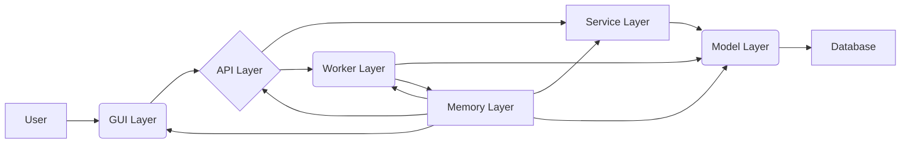
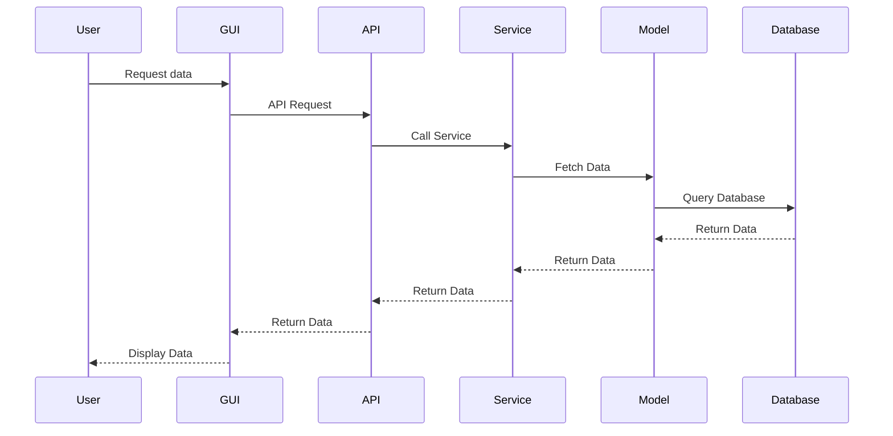
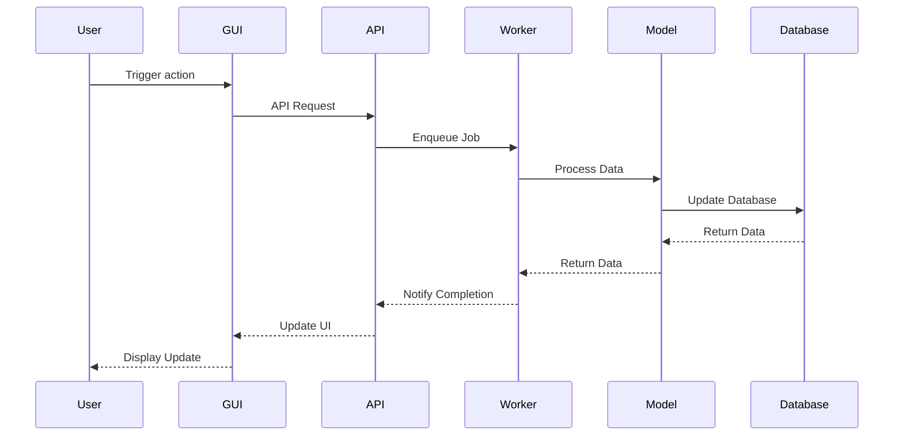
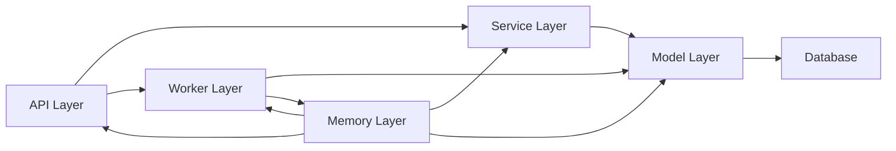
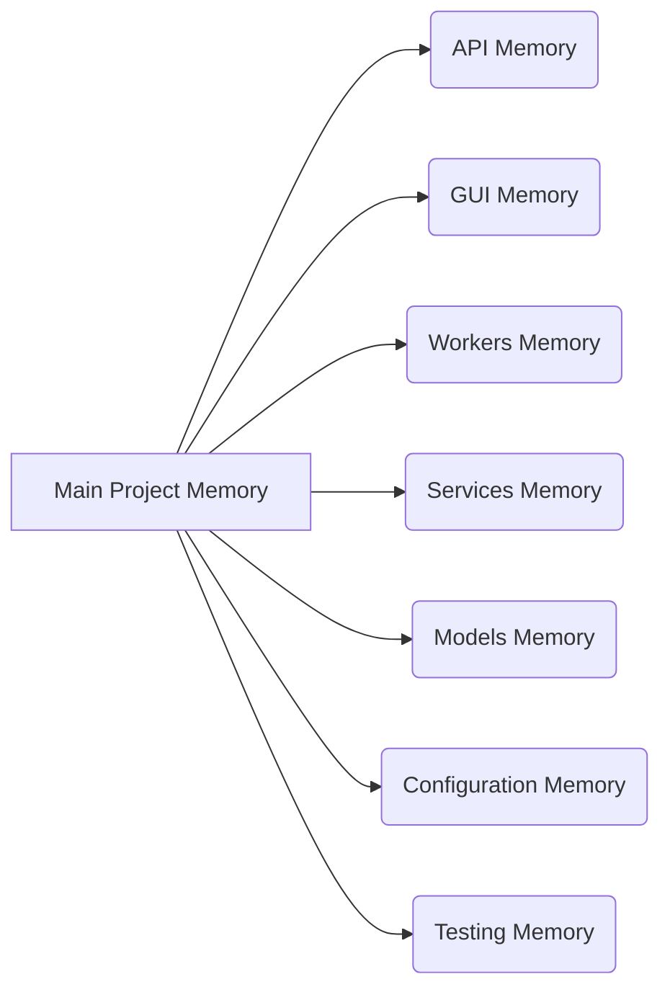
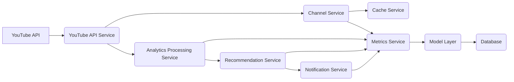

# System Design and Flowcharts

This document provides flowcharts and system designs using mermaidjs to visualize the system architecture and data flows.

## 1. System Architecture

This diagram shows the high-level architecture of the system, with the user interacting with the GUI layer, which communicates with the API layer. The API layer interacts with the service layer, which in turn interacts with the model layer and the database. The worker layer handles background tasks and also interacts with the model layer and the memory layer. The memory layer is used by all other layers.

## 2. API Request Flow

This diagram shows the sequence of interactions when a user requests data through the GUI. The GUI sends a request to the API, which calls the service layer. The service layer fetches data from the model layer, which queries the database. The data is then returned through the layers back to the user.

## 3. Background Job Flow

This diagram shows the sequence of interactions when a user triggers an action that requires a background job. The GUI sends a request to the API, which enqueues a job in the worker layer. The worker processes the data, updates the database, and notifies the API upon completion. The API then updates the GUI, which displays the update to the user.

## 4. Component Interactions

This diagram shows the interactions between the main components of the system. The API layer interacts with the service layer, which interacts with the model layer and the database. The API layer also interacts with the worker layer, which interacts with the model layer and the memory layer. The memory layer is used by all other layers.

## 5. Memory Structure

This diagram shows the hierarchical structure of the memory system. The main project memory is the root node, and it contains sub-memories for each component of the system.

## 6. Data Flow

This diagram shows the flow of data through the service layer. The YouTube API service retrieves data from the YouTube API, which is then processed by the analytics processing service, recommendation service, and notification service. The channel service manages channel data and interacts with the cache and metrics services. All services interact with the model layer, which interacts with the database.